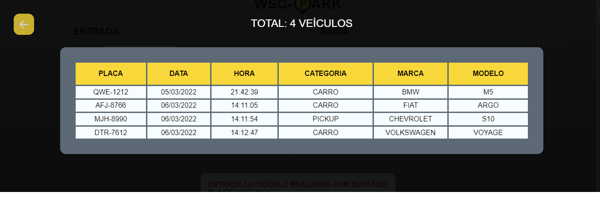
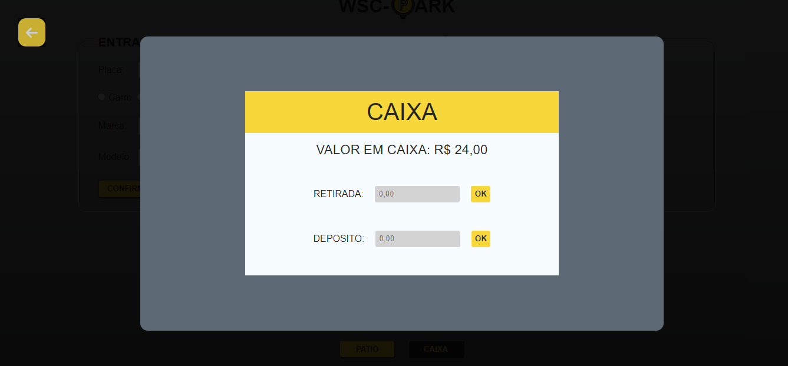

# Gerenciador de Estacionamento

  

  

## Tecnologias

Esse projeto foi desenvolvido com as seguintes tecnologias:  

## Projeto 

Sistema gerenciador de estacionamento responsivo

## Licença

Esse projeto está sob a licença MIT. Veja o arquivo [LICENSE](https://github.com/WyllianSilveira/Gerenciador-de-Estacionamento-/blob/main/LICENSE) para mais detalhes.
