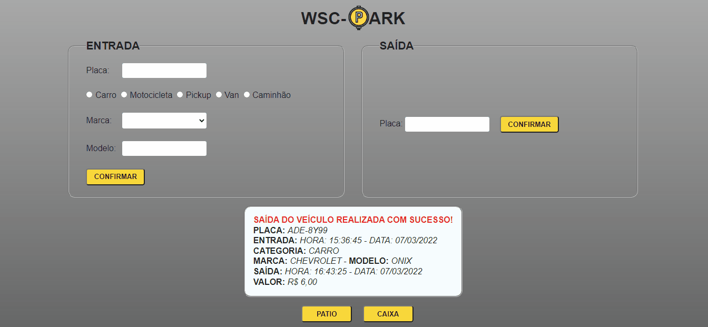

# Gerenciador de Estacionamento
 

  

 

## Tecnologias

Esse projeto foi desenvolvido com as seguintes tecnologias:  

## Sobre o projeto 
  
Sistema gerenciador de estacionamento com as funcionalidades de entrada de veículo capturando placa, categoria, marca e modelo, saída mostrando os dados do veículo
a data e hora e valor a ser pago, uma tela para controle do patio e outra do caixa

## Licença

Esse projeto está sob a licença MIT. Veja o arquivo [LICENSE](https://github.com/WyllianSilveira/Gerenciador-de-Estacionamento-/blob/main/LICENSE) para mais detalhes.
